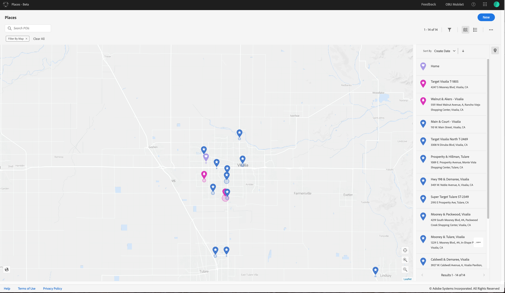

# 개요 {#home}

Adobe Places는 모바일 사용자의 참여를 이해하는 데 중요한 컨텍스트입니다. 모바일 앱 개발자는 이러한 맥락에서 앱 디자인을 향상시키고 보다 개인화되고 매력적인 경험을 제공할 수 있습니다. Places는 모바일 앱 개발자가 유연한 관심 영역 데이터베이스(POI)와 함께 사용하기 쉬운 리치 SDK 인터페이스를 사용하여 위치 컨텍스트를 이해할 수 있도록 하는 지리적 위치 서비스입니다.

장소에서는 다음을 수행할 수 있습니다.

* 다른 Adobe Experience Cloud 솔루션과 함께 사용할 수 있는 POI의 데이터베이스를 만들고 관리할 수 있습니다.
* 추가 속성을 지정하여 사용자 지정 메타데이터를 POI에 연결하여 보다 풍부하고 의미 있게 만들 수 있습니다.
* 맵에서 POI를 시각화하여 공간 컨텍스트를 손쉽게 파악하고 메타데이터 속성을 추가/편집할 수 있습니다.
* Adobe Experience Platform Launch에서 SDK를 구성하여 위치 기반 규칙 및 메타데이터 기반 조건을 정의합니다.
* 모니터 장치의 위치에 작성해야 하는 코드를 줄이고 Adobe의 위치 모니터를 사용하여 위치별 규칙을 자동으로 트리거합니다.

이를 통해 위치 신호에서 언제 어디에서나 실시간으로 조치를 취할 수 있습니다. 최적의 컨텍스트에 따라 모바일 참여도 향상

다음은 위치를 사용할 수 있는 몇 가지 방법입니다.

* 누군가 POI에 들어올 때 실시간 알림을 *보냅니다.경기장에 오신 것을 환영합니다."*
* 경쟁업체와 비교하여 자체 스토어의 발 트래픽을 분석할 수 있습니다.
* 위치 컨텍스트에서 고객 프로파일을 사용하여 오프라인 행동을 기반으로 고객을 세그먼트화할 수 있습니다.
* 고객과 연관성 높은 스토어의 경험을 갖춘 사용자를 타깃팅할 수 있습니다.

## 구성 요소 배치

위치는 다음 구성 요소로 구성됩니다.

* **웹 서비스 배치**

   REST API를 사용하여 POI를 만들고 관리할 수 있습니다. REST API에 대한 자세한 내용은 웹 [서비스](/help/places-rest-apis/api-usage/api-usage.md)배치를 참조하십시오.

* **위치 UI**

   맵에서 POI를 시각화하여 공간 컨텍스트를 파악하고 POI 및 사용자 정의 메타데이터를 추가/편집할 수 있습니다.

* **SDK 배치**

   모바일 앱의 위치 컨텍스트를 통합하는 멀티 플랫폼 모바일 API 인터페이스 SDK에 대한 자세한 내용은 Places extension [을](/help/configure-places-in-the-sdk/places-extension/places-extension.md)참조하십시오.

* **위치 규칙**

   시작 및 종료 이벤트를 사용하여 작업을 트리거할 수 있는 지리적 지능형 실행 규칙. 또한 이 규칙을 사용하면 조건에 지역 속성을 사용하여 경험을 개인화할 수 있습니다.

* **위치 모니터**

   모바일 앱에 임베드하여 사용자의 위치 변경 사항을 자동으로 모니터링하고 위치 규칙을 트리거할 수 있는 멀티 플랫폼 모바일 SDK입니다. 자세한 내용은 위치 모니터 [확장을](/help/configure-places-in-the-sdk/places-monitor-extension/places-monitor-extension.md)참조하십시오.

## 용어

다음은 이 문서에서 사용되는 몇 가지 일반적인 용어입니다.

* POI( **관심 영역)** 는 조직의 관심 영역입니다.

   이름, 반경, 주소, 카테고리 및 메타데이터 태그와 같은 특성을 사용하여 POI를 정의할 수 있습니다.

* 전염성은 **POI의** 한 종류이다.

   이 POI 유형은 위도 및 경도 좌표로 정의된 가상 지리적 경계입니다.

* 비콘은 **POI** 유형입니다.

   이 POI 유형은 저전력 블루투스 신호를 방출하여 위치를 나타내는 물리적 장치입니다. 비콘 지원이 향후 릴리스에서 제공될 예정입니다.

* 라이브러리는 **** 하나의 POI가 아닌 세트에 규칙을 쉽게 첨부하도록 그룹화된 POI 컬렉션입니다.

* SDK **익스텐션은** Places SDK를 모바일 앱에 통합하는 데 필요한 Experience Platform Launch 익스텐션입니다.

   사용자 경험에 위치 컨텍스트를 추가하기 위해 다른 모바일 SDK와 함께 사용되는 확장입니다.

* 조직은 **** Adobe Experience Cloud에서 귀사를 식별하는 Adobe 법인입니다.

   일반적으로 조직은 회사 이름입니다. 그러나 회사는 둘 이상의 조직을 가질 수 있습니다. 조직 관리자는 그룹 및 사용자를 구성하고 Single Sign-On 기능을 구성할 수 있습니다.

* orgID **는** Adobe Experience Platform에서 조직을 나타내는 ID입니다.

   자세한 내용은 orgID [찾기를 참조하십시오](https://forums.adobe.com/thread/2339895).

* The **Experience Cloud ID** service provides a universal, persistent ID that identifies your visitors across all the solutions in the Experience Cloud.

   For more information, see [Overview](https://docs.adobe.com/content/help/en/id-service/using/intro/overview.html).

## 위치 UI 이해

위치 UI에 액세스하려면 브라우저에서 위치 UI로 [이동하여](https://places.adobe.com) Adobe ID로 로그인합니다.

다음은 UI에 익숙해지는 데 도움이 되는 몇 가지 기본 정보입니다.

* 오른쪽 상단 모서리에는 라이브러리, POI를 만들고 검색을 필터링하기 위해 클릭할 수 있는 버튼이 있습니다.
* 화면의 오른쪽 아래 모서리에는 확대/축소, 현재 위치 가운데 맞춤, 지도 보기와 위성 보기 **[!UICONTROL Find Me]**&#x200B;간에 전환하는 단추가 있습니다.
* 두 번 클릭하여 확대하거나 클릭하고 드래그하여 맵을 다시 입력합니다.
* 화살표 키를 사용하여 맵을 스크롤할 수도 있습니다.

## 위치 워크플로우

위치 워크플로우의 고급 보기입니다.

